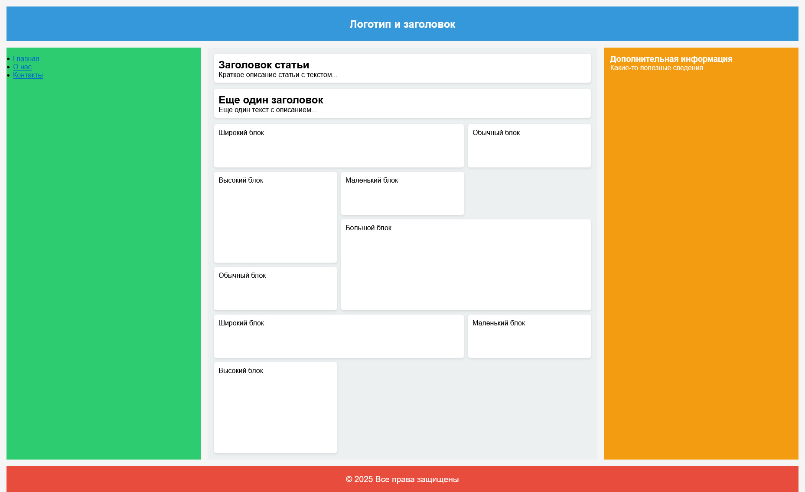

# Применение Grid для верстки страницы

## Цель:

Используя только CSS, оформить готовую HTML-страницу так, чтобы все элементы корректно располагались с помощью Grid.

_Все остальные стили кроме применения самого гридма - даны_

Условия:

- Вам дан файл index.html с готовой структурой страницы.
- Вам нужно дописать CSS-правила в styles.css, чтобы расположить элементы согласно макету, используя только Grid.

## Готовый макет

## Как сдавать

1. Создайте форк репозитория в организации `31ISP` с названием `uidev-lab5-вашафамилия`
2. Используя ветку `wip` оформите HTML документ `index.html`
3. Зафиксируйте изменения в вашем репозитории
4. Когда документ будет готов - создайте пул реквест из ветки `wip` (вашей) на ветку `main` (тоже вашу) и укажите меня ([ktkv419](https://github.com/ktkv419)) как reviewer

**Не мержите сами коммит**, это сделаю я после проверки задания
